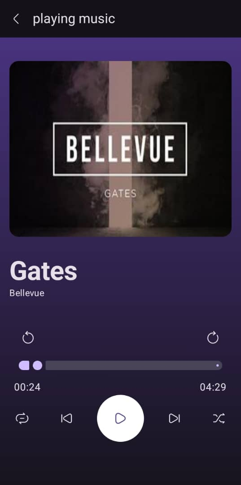
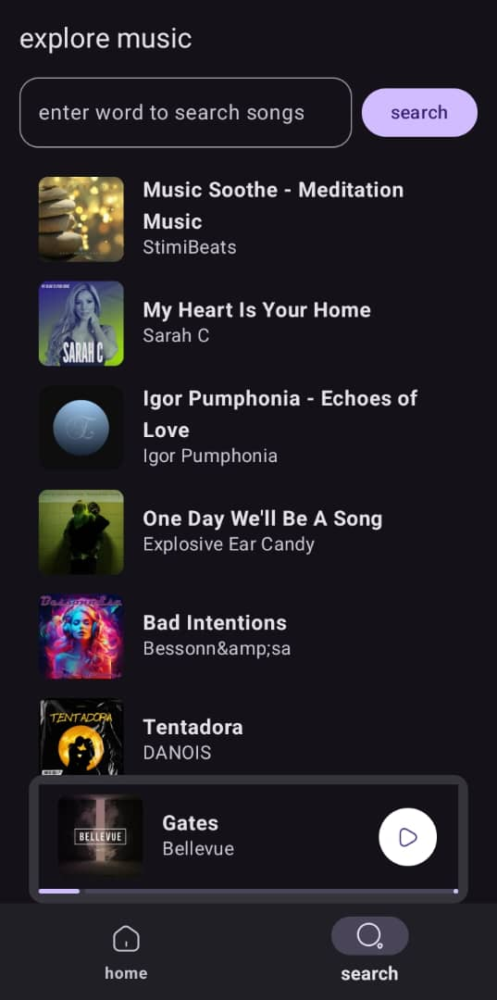
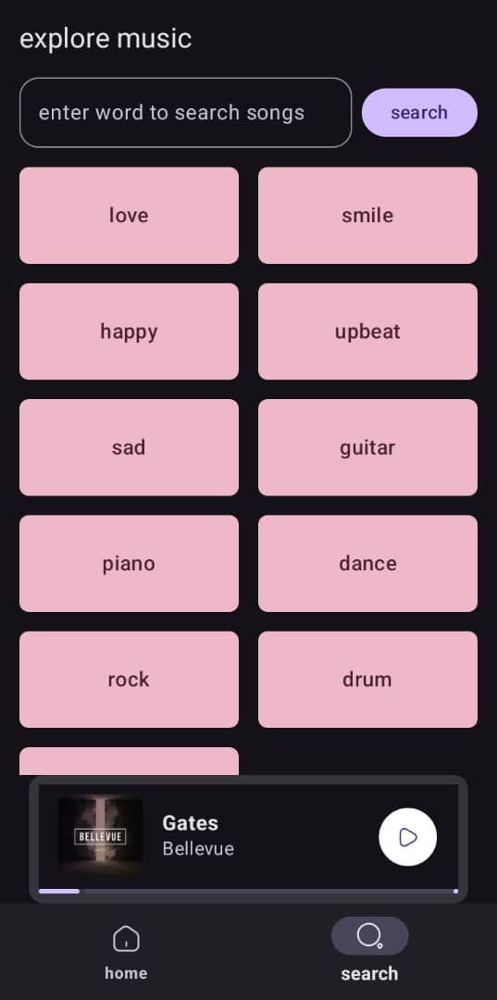
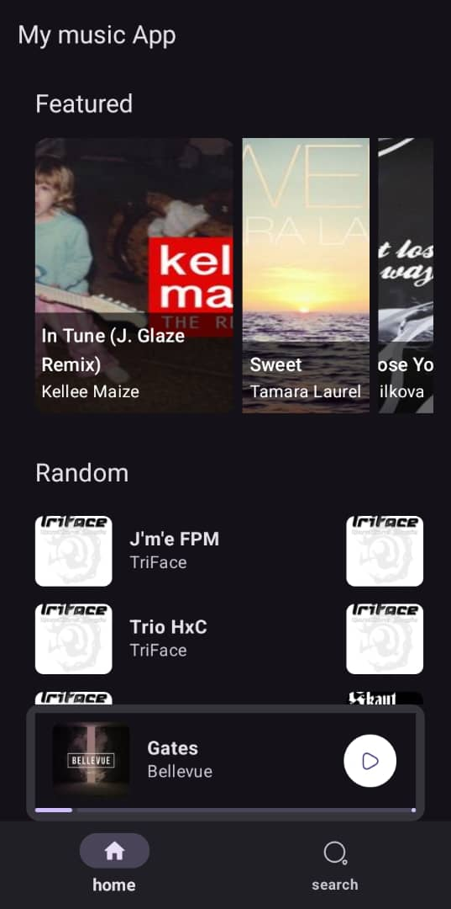
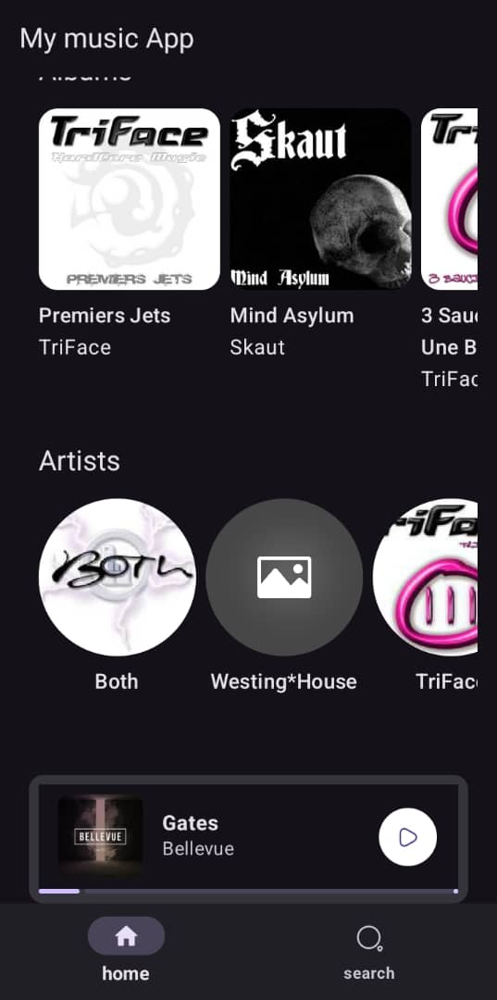

# MY MUSIC APP
this is a music app built with jetpack compose, for streaming music online

### Features
- stream music online
- media controls (pause,play,next,shuffle,seek,repeat)
- control bottom nav bar
- play a play list (albums,artist music)
- variety of music content(featured,artist,albums,random)
- search music
- show track info (image,artist name,song title,duration etc)

### how to run
- clone the repo
- register and obtain an API_KEY from jamendo : https://developer.jamendo.com/v3.0
- in the Api_contants.kt file, replace the value of the client_id with the api key
- run the app

### in-app implementations
- Implemted MVVM architecture
- use Glide to load images
- Impldmented foreground service to play the music, to enable background music playing
- used compose components: viewmodels,room,retrofit,hilt ...etc
- used room to catch music data locally: the music itself was not downloaded or
  saved on device to help keep the users memory space, rather metadata and infromation about the music
  was saved on device. This also applies to images< images where not downloaeded and stored on device
  rather links to the image where stored, to get the image from the web
- Some features like the homepage is offline first. The data is loaded from the local database first before the data from the api is obtained, which then updates the database information
- use dataStore to track last played song
- use hilt for dependency injection  